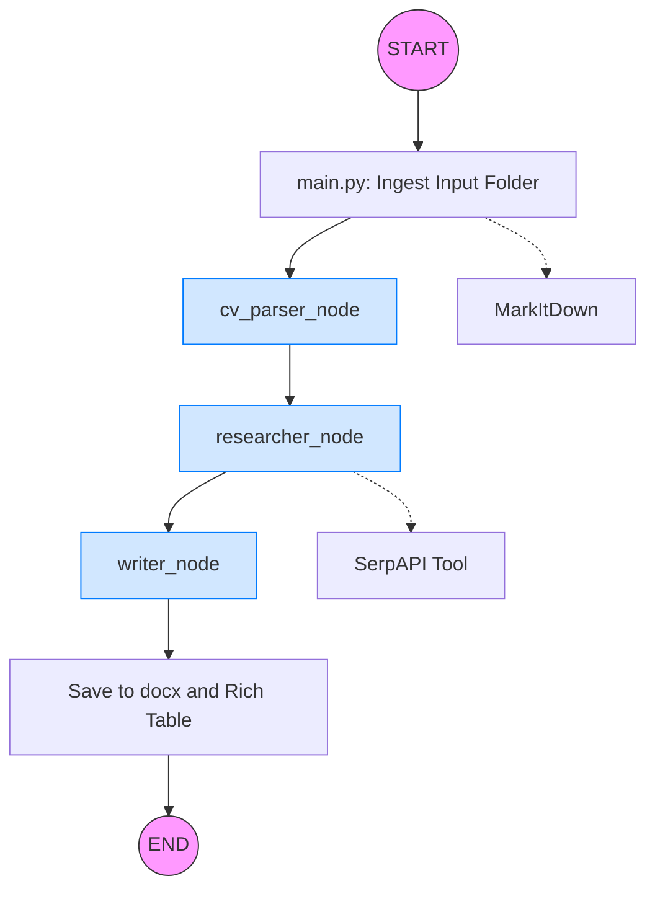

# 🤖 AI Career Matcher & Research Pipeline

A modular, state-driven AI pipeline that transforms a raw CV into a curated list of high-match job opportunities. Using a **Directed Acyclic Graph (DAG)** architecture powered by **LangGraph**, the system coordinates three specialized agents to parse, search, and analyze career data in real-time.

---

## 📊 Workflow Logic

The following diagram illustrates how the `AgentState` flows through the nodes, starting from document ingestion to the final generated report:



---

## 🌟 Key Features

* **Intelligent CV Parsing:** Transforms messy `.docx` or `.pdf` files into a structured `CandidateProfile` using a high-fidelity extraction engine.
* **Live Job Searching:** Integrates with **SerpAPI** (Google Jobs) to find real-world vacancies based on extracted skills, seniority, and specific location prompts.
* **Deep Fit Analysis:** A "Placement Specialist" agent scores matches (0-100%) and provides a detailed "Why you match" rationale for every role.
* **Rich CLI & Document Output:** View results in a beautiful terminal dashboard via `Rich` and receive a professionally formatted `.docx` report in the `files/output` folder.
* **Rate-Limited Stability:** Built-in `InMemoryRateLimiter` ensures the pipeline respects Google Gemini API quotas during deep analysis.

---

## 📂 Project Structure

| Directory/File | Description |
| --- | --- |
| `main.py` | Entry point. Handles file ingestion via `MarkItDown`, rich terminal UI, and document saving logic. |
| `graph.py` | Defines the LangGraph workflow, orchestrating node transitions and state updates. |
| `state.py` | Defines the `AgentState` TypedDict, managing the data passed between agents. |
| `schema.py` | Pydantic models (Schemas) for `CandidateProfile`, `RawJobMatch`, and `AnalysedJobMatch`. |
| `nodes/` | Specialized agent logic for CV parsing, live research, and match analysis. |
| `nodes/utils/tools.py` | Practical tools for external interaction, specifically the SerpAPI job scraper. |

---

## 🛠️ Installation & Setup

### 1. Prerequisites

* Python 3.10+
* [Google Gemini API Key](https://aistudio.google.com/)
* [SerpAPI Key](https://serpapi.com/) (for live Google Jobs data)

### 2. Environment Setup

Clone the repository and install dependencies:

```bash
pip install -r requirements.txt

```

Create an `.env` (or `alt.env`) file in the root directory:

```env
GOOGLE_API_KEY=your_gemini_key
SERPAPI_KEY=your_serpapi_key
CV_PARSE_GEMINI_MODEL=gemini-1.5-flash
SEARCH_GEMINI_MODEL=gemini-1.5-flash
WRITER_GEMINI_MODEL=gemini-1.5-pro

```

### 3. Add Your Documents

Place your resume (and optionally a sample cover letter) in `files/input/`. The system uses `MarkItDown` to support various formats including `.docx`, `.pdf`, and `.txt`.

---

## 🚀 Usage

Run the main application:

```bash
python main.py

```

1. **Input:** The script will ask: *"What kind of jobs are you looking for today?"* and *"Where are you looking today?"*
2. **Process:** Watch the agents coordinate:
* `Parsing cv...`
* `Researcher is researching...` (Iterative searches via SerpAPI)
* `Analysing jobs against your profile...`


3. **Result:** * A **Rich Table** displays job details, salary, and match reasoning in your terminal.
* A full report is saved to `files/output/YYYYMMDD_HHMM_name_job_research.docx`.


---

## 🛠️ Technologies Used

* **Orchestration:** [LangGraph](https://github.com/langchain-ai/langgraph)
* **LLM:** Google Gemini (1.5 Pro & Flash)
* **Search Engine:** SerpAPI (Google Jobs Engine)
* **Data Parsing:** Microsoft [MarkItDown](https://github.com/microsoft/markitdown)
* **UI/Formatting:** `Rich` (Terminal) & `python-docx` (Word Export)

Would you like me to help you format a `requirements.txt` file specifically for these libraries?