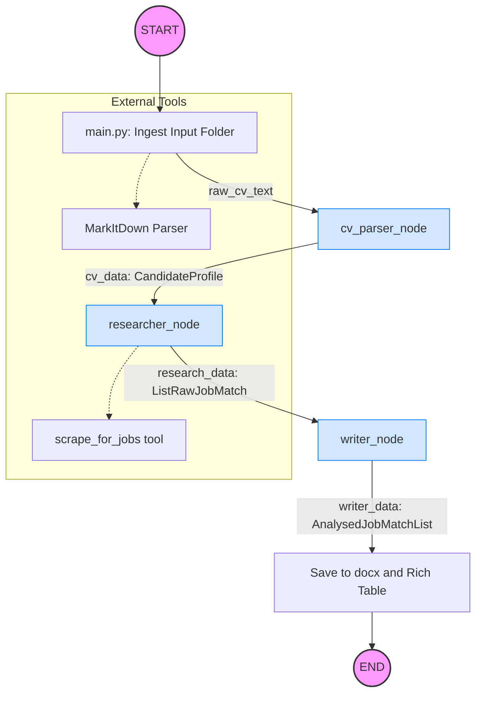

# 🤖 AI Career Matcher & Research Pipeline

A modular, state-driven AI pipeline that transforms a raw CV into a curated list of high-match job opportunities. Using a **Directed Acyclic Graph (DAG)** architecture, the system coordinates three specialized agents to parse, search, and analyze career data in real-time.

---

## 📊 Workflow Logic

The following diagram illustrates how the `AgentState` flows through your LangGraph nodes:



---

## 🌟 Key Features

* **Intelligent CV Parsing:** Extracts structured Pydantic models from messy `.docx` or `.pdf` files using a zero-creative, high-fidelity extraction engine.
* **Live Job Searching:** Integrates with **SerpAPI** (Google Jobs) to find real-world vacancies based on extracted candidate skills and user-defined location.
* **Deep Fit Analysis:** A "Placement Specialist" agent scores matches and provides a "Why you match" vs. "The Gap" analysis for every role using Gemini 1.5 Pro.
* **Rich CLI & Document Output:** View results in a beautiful terminal dashboard (via `Rich`) and receive a timestamped `.docx` report.
* **Automated Quality Assurance:** Includes a comprehensive `pytest` suite with GitHub Actions integration for continuous testing.

---

## 📂 Project Structure

| Directory/File | Description |
| --- | --- |
| `main.py` | Entry point. Handles file ingestion, rich terminal output, and document saving. |
| `graph.py` | Defines the LangGraph workflow logic and node transitions. |
| `nodes/` | Specialized logic for `cv_parser`, `researcher`, and `writer` agents. |
| `tests/` | Pytest suite including unit tests for nodes and tool mocks. |
| `.github/` | CI/CD configuration for automated testing on every push. |
| `schema.py` | Pydantic models for `CandidateProfile`, `RawJobMatch`, and `AnalysedJobMatch`. |

---

## 🛠️ Installation & Setup

### 1. Prerequisites

* Python 3.11+
* Google Gemini API Key 
* SerpAPI Key

### 2. Environment Setup

```bash
pip install -r requirements.txt
```

Create an `.env` file in the root directory with your keys for `GOOGLE_API_KEY` and `SERPAPI_KEY`.

### 3. Running Tests

We use `pytest` with `pytest-mock` to verify agent logic without consuming API credits:

```bash
pytest -v
```

---

## 🚀 Usage

Run the main application:

```bash
python main.py
```

1. **Input:** The script will ask for your target job title and location.
2. **Process:** The agents coordinate through the LangGraph workflow.
3. **Result:** View matches in the terminal and find your report in `files/output/`.

---

## 🛠️ Technologies Used

* **Orchestration:** [LangGraph](https://github.com/langchain-ai/langgraph)
* **LLM:** Google Gemini (Pro & Flash)
* **Search:** SerpAPI (Google Jobs Engine)
* **Testing:** Pytest & GitHub Actions
* **UI:** Rich (Terminal) & `python-docx` (Export)
