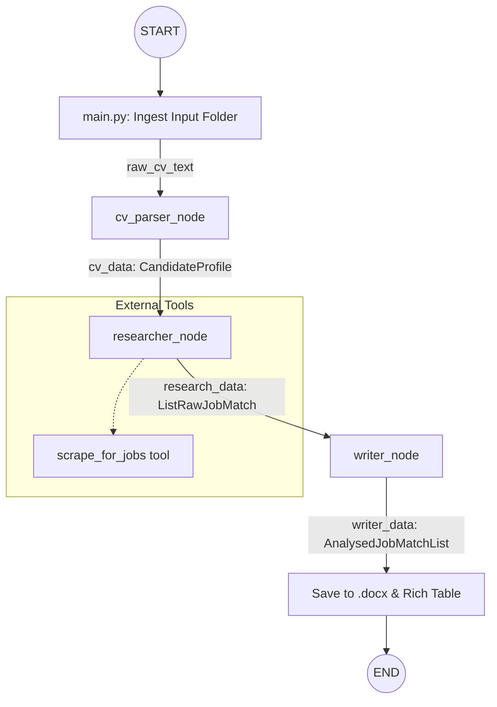

# 🤖 AI Career Matcher & Research Pipeline

A modular, state-driven AI pipeline that transforms a raw CV into a curated list of high-match job opportunities. Using a **Directed Acyclic Graph (DAG)** architecture, the system coordinates three specialized agents to parse, search, and analyze career data in real-time.

## 📊 Workflow Logic

The following diagram illustrates how the `AgentState` flows through your LangGraph nodes:



---

## 🌟 Key Features

* **Intelligent CV Parsing:** Extracts structured Pydantic models from messy `.docx` files using a zero-creative, high-fidelity extraction engine.
* **Live Job Searching:** Integrates with **SerpAPI** (Google Jobs) to find real-world vacancies based on extracted candidate skills and specific location (default: London).
* **Deep Fit Analysis:** A "Placement Specialist" agent scores matches and provides a "Why you match" vs. "The Gap" analysis for every role.
* **Rich CLI & Document Output:** View results in a beautiful terminal dashboard (via `Rich`) and receive a formatted `.docx` report.
* **Rate-Limited Processing:** Built-in safety guards for LLM API usage via `InMemoryRateLimiter` to manage Google Gemini quota.

---

## 📂 Project Structure

| Directory/File | Description |
| --- | --- |
| `main.py` | Entry point. Handles file ingestion, rich terminal output, and document saving. |
| `graph.py` | Defines the LangGraph workflow logic and node transitions. |
| `state.py` | Defines the `AgentState` TypedDict and stateful message history. |
| `schema.py` | Pydantic models for `CandidateProfile` and `AnalysedJobMatch`. |
| `nodes/` | Logic for `cv_parser`, `researcher`, and `writer` agents. |
| `nodes/utils/tools.py` | Tool definitions for SerpAPI searching and CV reading. |

---

## 🛠️ Installation & Setup

### 1. Prerequisites

* Python 3.10+
* Google Gemini API Key
* SerpAPI Key (for live job searching)

### 2. Environment Setup

Clone the repo and install dependencies:

```bash
pip install -r requirements.txt

```

Create a `.env` file in the root directory:

```env
GOOGLE_API_KEY=your_gemini_key
SERPAPI_KEY=your_serpapi_key
CV_PARSE_GEMINI_MODEL=gemini-1.5-flash
SEARCH_GEMINI_MODEL=gemini-1.5-flash
WRITER_GEMINI_MODEL=gemini-1.5-pro

```

### 3. Add Your Documents

Place your resume (and optionally a sample cover letter) in `files/input/`. The system currently supports `.docx` and `.txt`.

---

## 🚀 Usage

Run the main application:

```bash
python main.py

```

1. **Input:** The script will ask: *"What kind of jobs are you looking for today?"*
2. **Process:** The agents will coordinate in the background. You will see logs for:
* `Parsing CV...`
* `Researcher is researching...`
* `Analysing jobs against your profile...`


3. **Result:** * A **Rich Table** will appear in your terminal with job details, tech stacks, and match scores.
* A full research report is saved to `files/output/YYYYMMDD_name_job_research.docx`.


---

## 🛠️ Technologies Used

* **Orchestration:** [LangGraph](https://github.com/langchain-ai/langgraph)
* **LLM:** Google Gemini (Pro & Flash)
* **Search:** SerpAPI (Google Jobs Engine)
* **UI:** Rich (Terminal Formatting)
* **Document Handling:** `python-docx`
