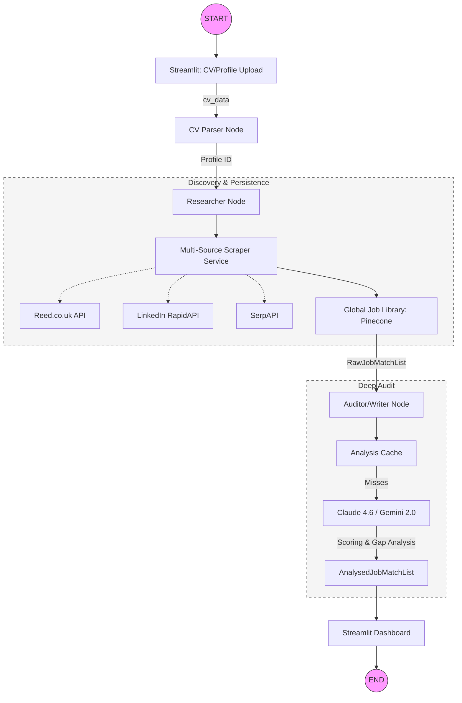

# 🤖 AI Career Matcher & Research Pipeline

A modular, state-driven **BYOK (Bring Your Own Key)** AI pipeline that transforms a raw CV into a curated, high-fidelity list of job opportunities. This system uses a **Directed Acyclic Graph (DAG)** architecture to coordinate specialized agents that perform deep gap analysis and seniority auditing in real-time.

---

## 📊 Workflow Architecture

The system orchestrates state transitions across high-concurrency nodes, utilizing your own vector database for persistent global job caching.


```mermaid
graph TD
    Start((START)) --> Ingest[Streamlit: CV/Profile Upload]
    Ingest -->|cv_data| Parser[CV Parser Node]
    Parser -->|Profile ID| Researcher[Researcher Node]
    
    subgraph Discovery_Phase [Discovery & Persistence]
        Researcher --> Scraper[Multi-Source Scraper Service]
        Scraper -.-> Reed[Reed.co.uk API]
        Scraper -.-> LinkedIn[LinkedIn RapidAPI]
        Scraper -.-> Google[SerpAPI]
        Scraper --> Sync[Global Job Library: Pinecone]
    end

    Sync -->|RawJobMatchList| Auditor[Auditor/Writer Node]
    
    subgraph Analysis_Phase [Deep Audit]
        Auditor --> Cache[Analysis Cache]
        Cache -->|Misses| LLM[Claude 4.6 / Gemini 2.0]
        LLM -->|Scoring & Gap Analysis| Results[AnalysedJobMatchList]
    end

    Results --> UI[Streamlit Dashboard]
    UI --> End((END))

    style Start fill:#f9f,stroke:#333
    style End fill:#f9f,stroke:#333
    style Discovery_Phase fill:#f5f5f5,stroke:#666,stroke-dasharray: 5 5
    style Analysis_Phase fill:#f5f5f5,stroke:#666,stroke-dasharray: 5 5
```

---

## 🌟 Key Features

* **Multi-Engine Precision Scraper:** Orchestrates parallel searches across **Reed**, **LinkedIn**, and **Google Jobs**. Uses a Cartesian product of titles and skills to ensure maximum market coverage.
* **The "Auditor" Guardrails:** Implements a strict **Track-Based Seniority Audit**. The system explicitly separates *Total Career Tenure* from *Relevant Track Experience* to prevent score hallucinations.
* **BYOK Persistence (Pinecone):** 
  *  **Namespace Isolation:** Segregates raw global job data from user-specific match analyses.
  * **Deterministic Deduplication:** URL-based hashing ensures a single source of truth across multiple job boards.
* **High-Fidelity Markdown UI:** A custom text-processing engine that converts messy HTML/text into professional, scannable briefings.
* **Niche Skill Prioritization:** Specific weighting logic for high-value certifications (e.g., **Quantexa**, **Databricks**) to surface specialized opportunities.

---

## 🛠️ Installation & Setup

### 1. Prerequisites (BYOK)
To run this pipeline, you must provide your own API keys and infrastructure names:

* **Embedding Model:** A valid model ID (e.g., `models/gemini-embedding-001`).
* **Vector DB:** A [Pinecone](https://www.pinecone.io/) Index (ensure dimensions match your chosen embedding model).
* **LLM Providers:** Anthropic (Claude), OpenAI (ChatGPT), Google (Gemini) keys.
* **Scrapers**:
  * A [SerpAPI](https://serpapi.com/) key for Google Job search (generous free tier)
  * A [RapidAPI](https://rapidapi.com/hub) key for LinkedIn Job search (limited free tier)
  * A [Reed](https://www.reed.co.uk/developers/) key for Reed Job search (free)

### 2. Environment Configuration
Create a `.streamlit/secrets.toml` or a root `.env` file:

```toml
EMBEDDING_MODEL = "gemini-embedding-001"
PINECONE_API_KEY = "your_pinecone_key"
PINECONE_NAME = "your_index_name"
GEMINI_API_KEY = "your_gemini_key"
```

### 3. Launching the App
```bash
# Install dependencies
pip install uv
uv pip install -r requirements.txt

# Launch the Streamlit dashboard
streamlit run dashboard.py
```

---

## 🚀 The Auditor Logic
The system's "Auditor" node is programmed to be **Hyper-Critical**. Every match includes a conservative 0-100 score and a "Gap Analysis" covering:
1.  **Seniority Audit:** Explicitly compares "Years in Track" vs. Job Requirements.
2.  **Tech Stack Synergies:** Bolds "Anchor" skills and highlights missing technologies.
3.  **Retention Risk:** Flags roles that are significantly above or below the candidate's professional maturity.

---

## 🛠️ Tech Stack
* **Orchestration:** [LangGraph](https://github.com/langchain-ai/langgraph)
* **Models:** Gemini, Anthropic, OpenAI
* **Vector Database:** Pinecone (Serverless)
* **Search Engines:** Reed API, SerpAPI, LinkedIn (RapidAPI)
* **UI:** Streamlit
