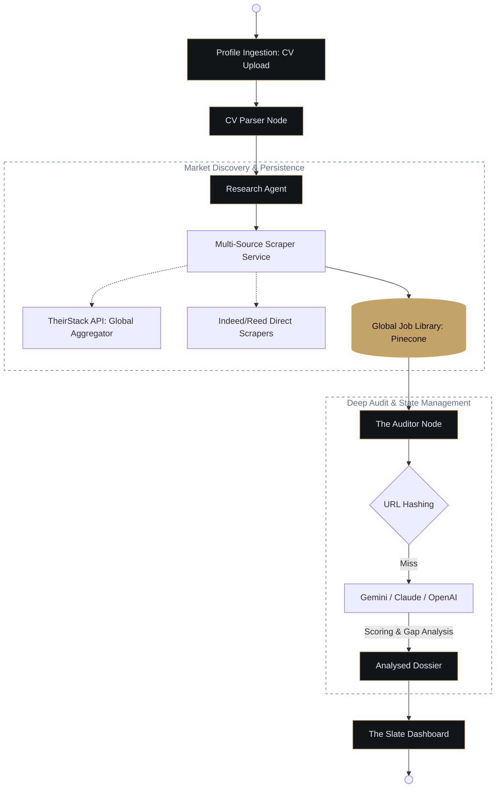

# 

**Boutique Market Intelligence & Agentic Research Pipeline**
*A state-driven BYOK (Bring Your Own Key) architecture for high-fidelity career auditing.*

-----


### SYSTEM PHILOSOPHY

Traditional job boards prioritize ad-impressions and candidate volume. **The Slate** prioritizes **Signal**.

This system transforms a raw CV into a curated, high-fidelity dossier using a **Directed Acyclic Graph (DAG)** architecture. It coordinates specialized agents to perform real-time gap analysis and seniority auditing, ensuring you only engage with roles where you are the top 1% candidate.

-----

### WORKFLOW ARCHITECTURE

The pipeline orchestrates state transitions across high-concurrency nodes, utilizing a "Triple-Layer" discovery strategy and persistent global job hashing.


```mermaid
graph TD
    classDef slate fill:#12151A,stroke:#C5A267,stroke-width:1px,color:#E2E8F0;
    classDef gold fill:#C5A267,stroke:#C5A267,stroke-width:1px,color:#0C0E12;
    classDef ghost fill:none,stroke:#64748B,stroke-dasharray: 5 5,color:#64748B;

    Start(( )) --> Ingest[Profile Ingestion: CV Upload]
    Ingest --> Parser[CV Parser Node]
    Parser --> Researcher[Research Agent]
    
    subgraph Discovery [Market Discovery & Persistence]
        Researcher --> Scraper[Multi-Source Scraper Service]
        Scraper -.-> Aggregator[TheirStack API: Global Aggregator]
        Scraper -.-> Direct[Indeed/Reed Direct Scrapers]
        Scraper --> Sync[(Global Job Library: Pinecone)]
    end

    Sync --> Auditor[The Auditor Node]
    
    subgraph Analysis [Deep Audit & State Management]
        Auditor --> Cache{URL Hashing}
        Cache -->|Miss| LLM[Gemini / Claude / OpenAI]
        LLM -->|Scoring & Gap Analysis| Results[Analysed Dossier]
    end

    Results --> UI[The Slate Dashboard]
    UI --> End(( ))

    class Ingest,Parser,Researcher,Auditor,Results,UI slate;
    class Sync gold;
    class Discovery,Analysis ghost;
```

-----

### CORE CAPABILITIES

#### 1\. Tenacious Multi-Source Discovery

The system bypasses the limitations of single-platform searches by orchestrating a **Triple-Layer Discovery Strategy**:

  * **The Aggregator:** Leverages **TheirStack API** for horizontal breadth across 300k+ sources.
  * **The Direct Line:** High-tenacity scrapers for **Reed** and **Indeed (via HasData)** to bypass rate limits.
  * **The Indexer:** Uses **SerpAPI** for deep-indexing Google Jobs from direct company career pages.

#### 2\. Semantic Proximity & Persistence

  * **Profile Embeddings:** Uses `text-embedding-001` to create vector representations of professional DNA for conceptual alignment.
  * **Deterministic Deduplication:** A URL-hashing layer ensures a single source of truth; the pipeline never audits the same listing twice.
  * **Niche Skill Prioritization:** Specific weighting for high-value technologies including **Quantexa**, **Databricks**, and **Terraform**.

#### 3\. The "Auditor" Logic

The reasoning node is programmed to be **Hyper-Critical**. Every match includes a 0-100 score and a gap analysis covering:

  * **Seniority Parity:** Compares *Total Career Tenure* vs. *Relevant Track Experience* to prevent "seniority hallucination."
  * **Skill Stack Synergies:** Bolds "Anchor" skills and flags missing dependencies.
  * **Maturity Audit:** Flags roles significantly above or below professional "Sweet Spots."

-----

### TECHNICAL STACK

  * **Orchestration:** LangGraph / LangChain
  * **Intelligence:** Gemini 1.5 Pro, Claude 3.5, OpenAI
  * **Vector Engine:** Pinecone (Serverless)
  * **Search Tier:** TheirStack, HasData, Reed API, SerpAPI
  * **UI Framework:** Streamlit (Custom Obsidian-Gold CSS)

-----

### CONFIGURATION (BYOK)

**1. Environment**
Create `.streamlit/secrets.toml` or a `.env` file:

```toml
GEMINI_API_KEY = "your_key"
THEIRSTACK_API_KEY = "your_key"
PINECONE_API_KEY = "your_key"
PINECONE_NAME = "your_index"
```

**2. Deployment**

```bash
pip install uv
uv pip install -r requirements.txt
streamlit run main.py
```

-----

**Engineered by Ruy Zambrano**
*Stop chasing ghosts. Audit the market.*

[](https://ko-fi.com/ruyzambrano)