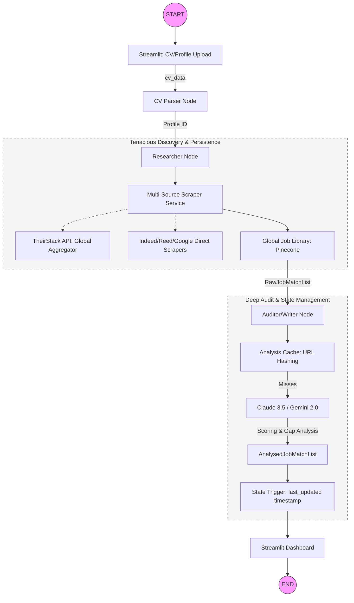

# 🤖 AI Career Matcher & Research Pipeline (2026 Edition)


A modular, state-driven **BYOK (Bring Your Own Key)** AI pipeline that transforms a raw CV into a curated, high-fidelity list of job opportunities. This system uses a **Directed Acyclic Graph (DAG)** architecture to coordinate specialized agents that perform deep gap analysis and seniority auditing in real-time.

---

## 📊 Workflow Architecture

The system orchestrates state transitions across high-concurrency nodes, utilizing a "Triple-Layer" scraping strategy and persistent global job caching.


```mermaid
graph TD
    Start((START)) --> Ingest[Streamlit: CV/Profile Upload]
    Ingest -->|cv_data| Parser[CV Parser Node]
    Parser -->|Profile ID| Researcher[Researcher Node]
    
    subgraph Discovery_Phase [Tenacious Discovery & Persistence]
        Researcher --> Scraper[Multi-Source Scraper Service]
        Scraper -.-> Aggregator[TheirStack API: Global Aggregator]
        Scraper -.-> Direct[Indeed/Reed/Google Direct Scrapers]
        Scraper --> Sync[Global Job Library: Pinecone]
    end

    Sync -->|RawJobMatchList| Auditor[Auditor/Writer Node]
    
    subgraph Analysis_Phase [Deep Audit & State Management]
        Auditor --> Cache[Analysis Cache: URL Hashing]
        Cache -->|Misses| LLM[Claude 3.5 / Gemini 2.0]
        LLM -->|Scoring & Gap Analysis| Results[AnalysedJobMatchList]
        Results --> State[State Trigger: last_updated timestamp]
    end

    State --> UI[Streamlit Dashboard]
    UI --> End((END))

    style Start fill:#f9f,stroke:#333
    style End fill:#f9f,stroke:#333
    style Discovery_Phase fill:#f5f5f5,stroke:#666,stroke-dasharray: 5 5
    style Analysis_Phase fill:#f5f5f5,stroke:#666,stroke-dasharray: 5 5
```

---

## 🌟 Key Features

* **Tenacious Multi-Source Scraper:** Combines the breadth of **TheirStack** (LinkedIn, Glassdoor, 300k+ sites) with the precision of direct scrapers (**Reed**, **Indeed via HasData**, and **Google Jobs**).
* **The "Auditor" Guardrails:** Implements a strict **Track-Based Seniority Audit**. The system explicitly separates *Total Career Tenure* from *Relevant Track Experience* to prevent score hallucinations.
* **Semantic Retrieval & Persistence:** 
  * **Profile Embeddings:** Uses CV summaries as search vectors to find "hidden" matches that keyword-based systems miss.
  * **Deterministic Deduplication:** URL-based hashing ensures a single source of truth; you never pay LLM tokens to analyze the same job twice.
* **State-Driven Reactivity:** A custom "Cache Buster" logic using `st.session_state.last_updated` ensures the UI refreshes instantly when the AI finishes a background research task.
* **Niche Skill Prioritization:** Specific weighting logic for high-value certifications (e.g., **Quantexa**, **Databricks**, **Terraform**) to surface specialized opportunities.

---

## 🛠️ Installation & Setup

### 1. Prerequisites (BYOK)
To run this pipeline, you must provide your own API keys:

* **Vector DB:** A [Pinecone](https://www.pinecone.io/) Index (Serverless recommended).
* **LLM Providers:** Google (Gemini - *Recommended for Free Tier*), Anthropic (Claude), or OpenAI.
* **Market Access**:
  * **TheirStack**: For global aggregated listings (LinkedIn/Indeed/Glassdoor).
  * **HasData**: For high-tenacity Indeed scraping (bypasses 429 rate limits).
  * **Reed**: For direct UK market access.
  * **SerpAPI**: For local Google Jobs indexing.

### 2. Environment Configuration
Create a `.streamlit/secrets.toml` file:

```toml
EMBEDDING_MODEL = "models/text-embedding-004"
GEMINI_API_KEY = "your_key"
PINECONE_API_KEY = "your_key"
PINECONE_NAME = "your_index_name"
```

### 3. Launching the App
```bash
# Install dependencies
pip install uv
uv pip install -r requirements.txt

# Launch the dashboard
streamlit run dashboard.py
```

---

## 🚀 The Auditor Logic
The system's "Auditor" node is programmed to be **Hyper-Critical**. Every match includes a conservative 0-100 score and a "Gap Analysis" covering:
1.  **Seniority Audit:** Explicitly compares "Years in Track" vs. Job Requirements.
2.  **Tech Stack Synergies:** Bolds "Anchor" skills and highlights missing technologies (e.g., AWS, LLM Orchestration).
3.  **Retention Risk:** Flags roles that are significantly above or below the candidate's professional maturity.

---

## 🛠️ Tech Stack
* **Orchestration:** LangGraph / LangChain
* **Models:** Gemini, Claude, OpenAI
* **Vector Database:** Pinecone (Serverless)
* **Search Tier:** TheirStack, HasData (Indeed), Reed API, SerpAPI, RapidAPI
* **UI Framework:** Streamlit (Custom State Management)

---

### 🧠 Why This Matters
Standard job boards use "dumb" keyword matching. This pipeline uses **Semantic Proximity** to understand *who you are* and **Agentic Reasoning** to verify if a company *actually wants you*. It’s not just a search tool; it’s a pre-screening agent.

---

### ☕ Support the Agentic Research
If this pipeline helped you skip the manual grind or surface a "hidden gem" role, consider supporting the project! Your contributions help cover the API costs for further "High-Tenacity" scraper development.

[](https://ko-fi.com/YOUR_KOFI_USERNAME)

---